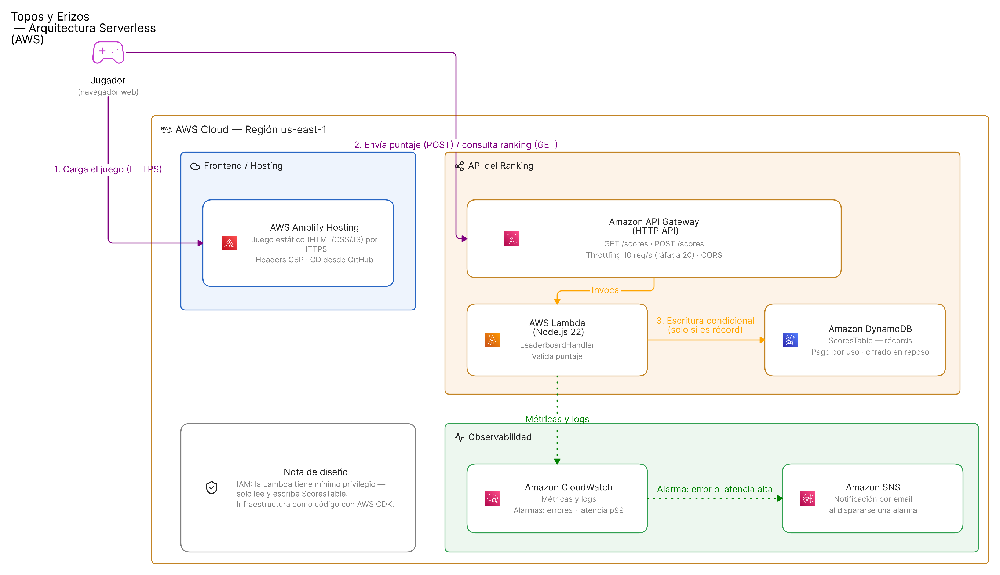

# 🕹️ Topos y Erizos — ¡Aplástalos!

Un juego para jugar en 3 minutos: sin instalar nada, sin crear una cuenta y sin
publicidad. Tu puntaje compite al instante en un ranking mundial real.

### ▶️ Jugar ahora: **https://main.d2h64nxxh4ok2a.amplifyapp.com**

---

## 🎮 De qué se trata

Aplastá topos con el martillo y esquivá erizos a lo largo de **10 fases** que se
van poniendo más difíciles de a poco, nunca de golpe.

- **Cada criatura tiene su truco:** algunos topos aguantan más golpes, otros se
  disfrazan, y a los erizos **no** hay que pegarles.
- **Combos:** encadená golpes seguidos y tus puntos se multiplican.
- **Hordas:** al cerrar cada fase, todos los personajes salen juntos.
- **Ranking mundial:** elegís tu nombre y tu personaje, sin registrarte.
- Todo lo que ves y escuchás se dibuja y se sintetiza por código, en el momento:
  el juego no descarga ninguna imagen ni ningún archivo de audio, por eso pesa
  tan poco y anda bien hasta en internet lento.

---

## ⚙️ Cómo funciona por detrás



El juego corre entero en tu navegador. Lo único que viaja a la nube es tu
puntaje final, cuando termina la partida.

Pensá en la base de datos como una **libreta de récords**, y en la función
Lambda como el **portero** que la cuida: es el único que puede escribir en
ella. Antes de anotar nada, revisa que el puntaje tenga sentido, limpia el
nombre del jugador, y solo actualiza el récord si el nuevo puntaje es
mejor que el guardado.

| Pieza | Para qué sirve |
|---|---|
| **Amplify Hosting** | Publica el juego, con conexión segura (HTTPS) |
| **API Gateway** | Recibe los puntajes y frena el tráfico abusivo |
| **Lambda** | El portero: revisa y guarda cada puntaje |
| **DynamoDB** | La libreta de récords |
| **CloudWatch + SNS** | El sistema de alarma: avisa por correo si algo falla |
| **AWS CDK** | La receta que arma toda esta nube con un solo comando |

---

## ✨ Decisiones destacadas

- **El servidor no le cree al navegador.** Cualquier puntaje que llega se revisa
  y se limpia del lado del servidor, así que nadie puede escribir directo en la
  base de datos ni mandar datos maliciosos.
- **Todo se puede reconstruir con un comando.** La nube entera está descrita
  como código (AWS CDK), y se valida sola contra errores y fallas de seguridad
  antes de publicarse.
- **Hay alguien vigilando.** Si algo falla o se pone lento, llega un aviso
  automático por correo.
- **Cuesta $0.** Toda la solución corre dentro de la capa gratuita de AWS.
- **Se publica solo.** Cada cambio en la rama `main` se sube automáticamente,
  sin pasos manuales.

---

## 🚀 Cómo desplegarlo

Necesitás Node.js 20+ y una cuenta de AWS configurada (`aws configure`).

```bash
cd infra
npm install
npx cdk deploy
```

Al terminar, copiá la URL que aparece en el output (`ApiUrl`) dentro de
`script.js`, y publicá `index.html`, `style.css` y `script.js` en Amplify
Hosting.

Para correr las pruebas de la infraestructura: `npm test`

---

Desarrollado con **Kiro** · Licencia MIT
